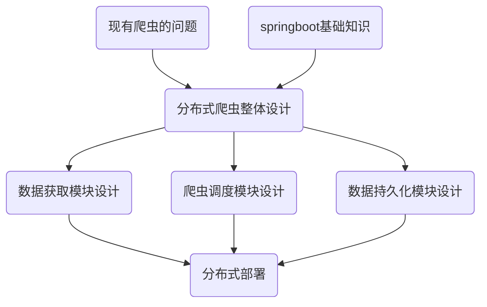

# SB-Crawler

## 项目简介

项目是一个基于Springboot的分布式爬虫系统，被开发用于多机环境下的爬虫快速开发与部署。

## 项目背景

Web开发技术在过去十年中飞速发展，现已进入分布式与微服务的时代，现有的基于java语言的爬虫框架，如webmagic、webcontroller、Heritrix等爬虫框架均基于单机的前提下开发，已然无法良好地适应现今的环境，如若将其进行分布式的二次开发又受限于原设计的局限性而导致困难重重。本项目在该时代背景下，基于Springboot框架开发一个原生适配分布式的爬虫框架。

## 系统结构图

## 系统设计

本项目以Redis为信息交互中心，将传统爬虫的三个主要功能拆分成了三个微服务模块：Endpoint，Dispather，Receiver。接下来介绍三个模块与Redis、Mysql的在整个爬虫中的角色与主要功能。

Redis: Redis作为系统的信息交互核心，充当着各模块的数据交互中介者的角色。其主要功能为接收Dispather的爬取指令并提供指令给Endpoint、接收Endpoint的爬取结果并将爬取结果提供给Receiver存入数据库中。此外，Redis还维护者爬虫系统的错误信息、Endpoint的实时状态等运维信息

Dispatcher：Dispatcher作为系统的数据流动起点，充当着系统的操作中枢角色。其主要功能为在接收到管理员的爬取请求或定时任务触发后，生成爬取指令并提交到redis中。

Endpoint：Endpoint作为系统的外界数据获取模块，充当着系统数据获取的核心角色。其主要的功能是根据得到的爬取指令到各个网站上获取数据并把数据提交到redis中等待入库

Receiver：Receiver作为系统的数据终点，充当着处理系统流动数据的角色。其主要的功能是根据redis中获得的数据进行查重并入库。

Mysql：数据的存放地点，所有的错误数据、用户信息、爬虫结果均存放在mysql数据库中

