# 爬虫开发环境配置

## 架构描述

整体架构图

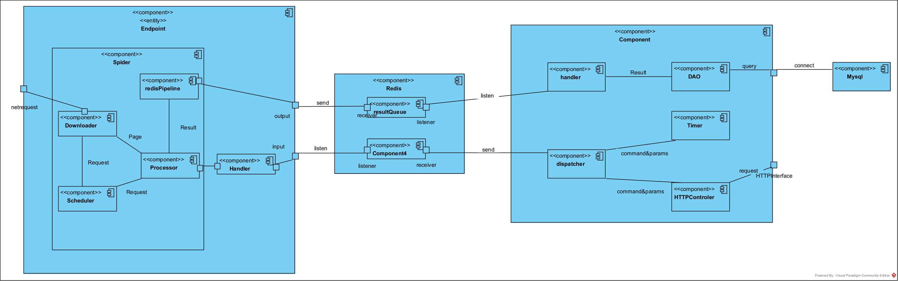

整体爬虫架构如上图

## 开发环境

Windows11 + JDK15 + maven-3.6.3

## 数据库配置

### redis

需要Redis 6.2 以上的Redis版本

### Mysql

需要Mysql5.0以上的版本

请提前创建好数据库并导入docs下的database.sql

## Dispatcher配置

整体配置基于IDEA配置，请先确保拥有IDEA

### 第一步 从Git上download/checkout源代码

下载源代码或checkout不再过多赘述

下载完后会得到这样一个文件夹

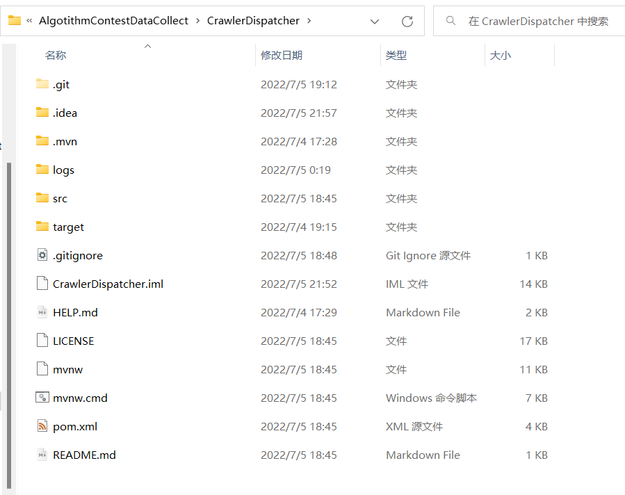

用IDEA打开该文件夹完成该步骤

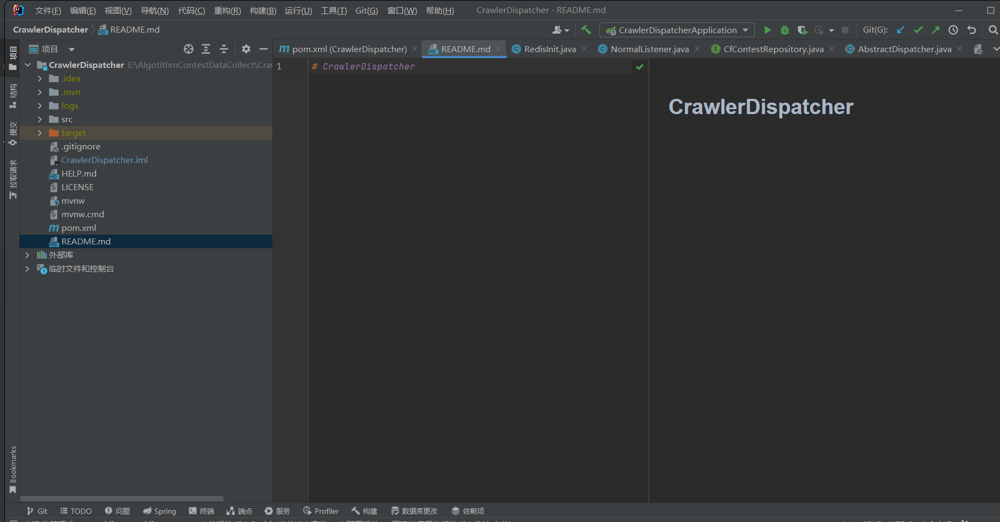

### 第二步 Maven载入包

首先点开pom.xml

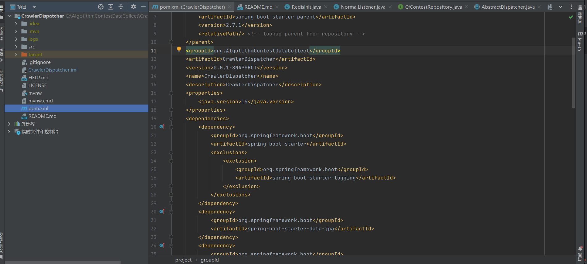

最右侧有个Maven栏，点开

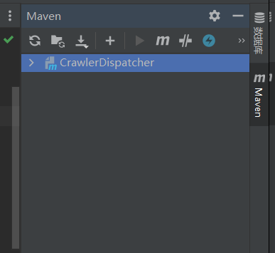

点击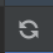即可开始下载启动需要的包

同步完成且无报错即可完成构建

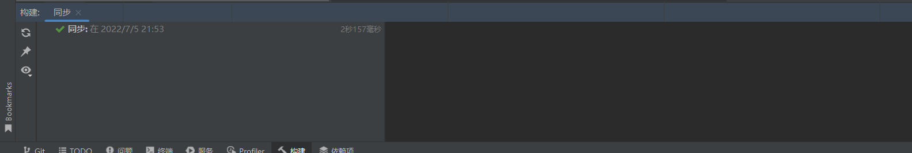


### 第三步 配置配置文件

点开src/main/resources/application.properties

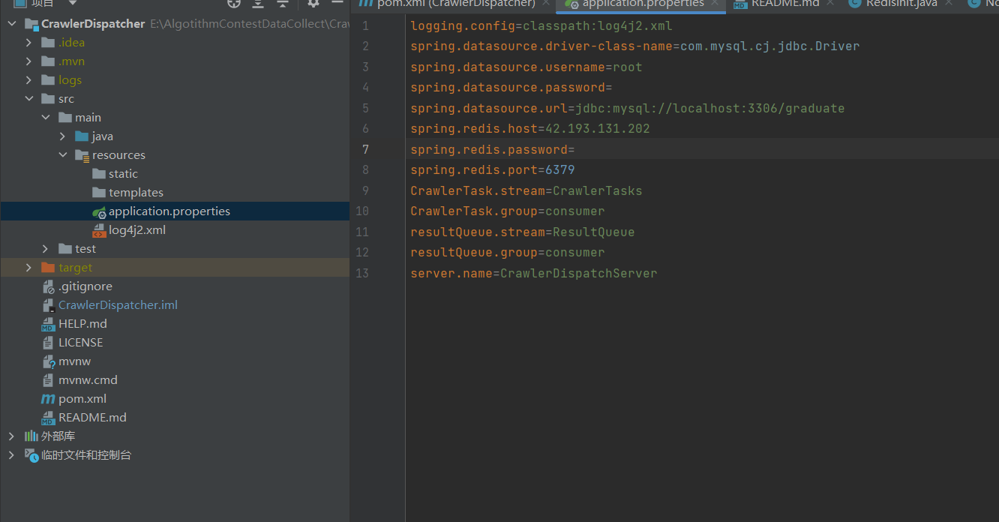

```properties
# 日记配置不用管
logging.config=classpath:log4j2.xml 
# mysql处理类不用管
spring.datasource.driver-class-name=com.mysql.cj.jdbc.Driver
# mysql用户名
spring.datasource.username=root
# mysql密码
spring.datasource.password=
# mysql连接url，把{addr}改成数据库服务器地址，{port}改成具体端口，{databaseName}改成具体数据库名
spring.datasource.url=jdbc:mysql://{addr}:{port}/{databaseName}
#redis服务器地址
spring.redis.host=42.193.131.202
#redis服务器密码
spring.redis.password=
#redis服务器端口
spring.redis.port=6379
#爬虫任务消息队列名称,注意与爬虫终端(EndPoint)相同
CrawlerTask.stream=CrawlerTasks
#爬虫任务消费者组名称,注意与爬虫终端(EndPoint)相同
CrawlerTask.group=consumer
#爬虫结果消息队列名称,注意与爬虫终端(EndPoint)相同
resultQueue.stream=ResultQueue
#爬虫结果消费者组名称,注意与爬虫终端(EndPoint)相同
resultQueue.group=consumer

server.name=CrawlerDispatchServer
```


#### 第四步 启动

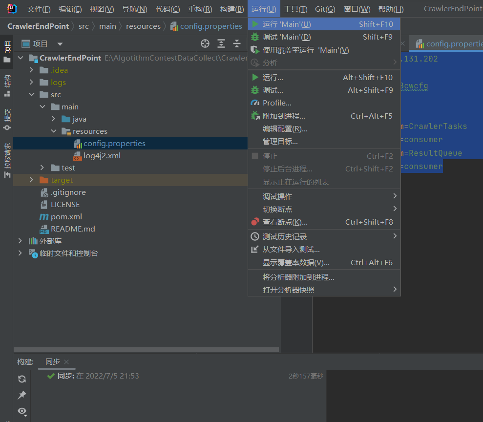

点击运行即可启动

启动完成状态

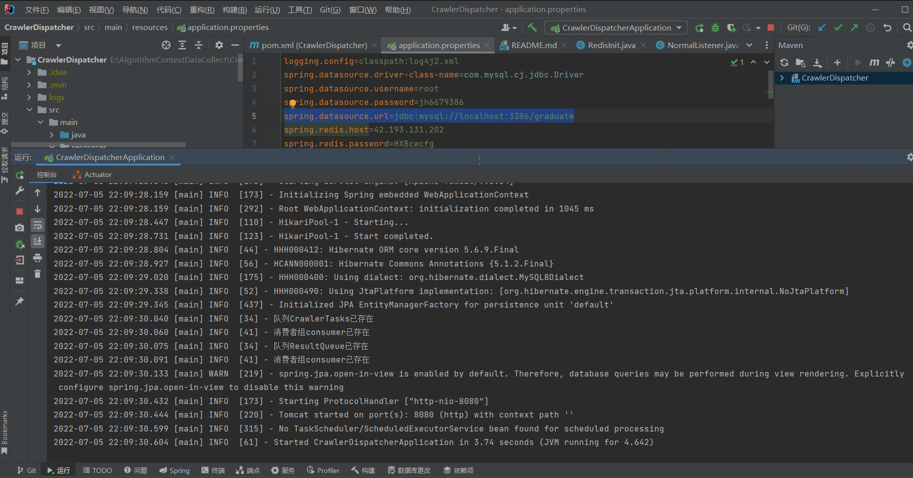


## ENDPoint配置

整体配置基于IDEA配置，请先确保拥有IDEA

### 第一步 从Git上download/checkout源代码

下载源代码或checkout不再过多赘述

下载完后会得到这样一个文件夹

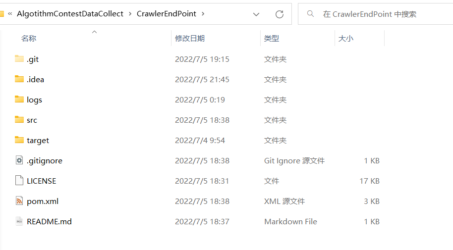

用IDEA打开该文件夹完成该步骤

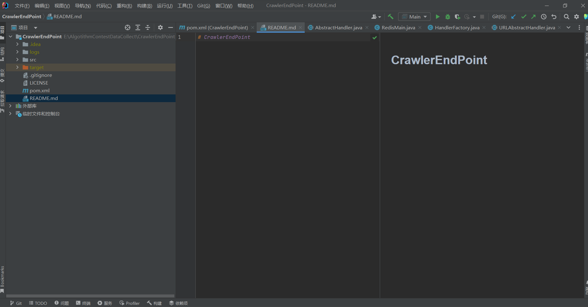


### 第二步 Maven载入包

首先点开pom.xml

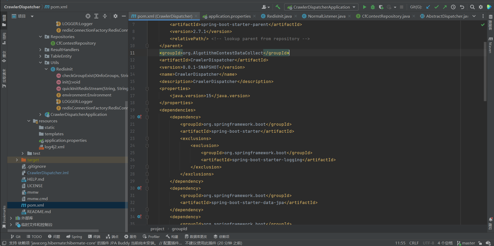

最右侧有个Maven栏，点开

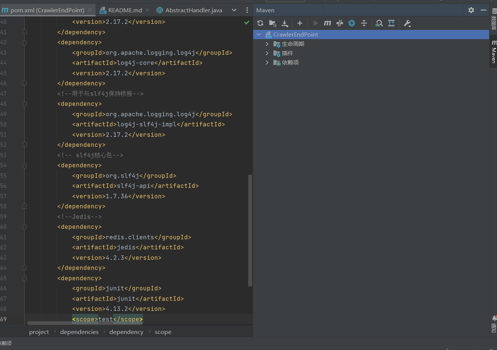

点击即可开始下载启动需要的包

同步完成且无报错即可完成构建


### 第三步 配置配置文件

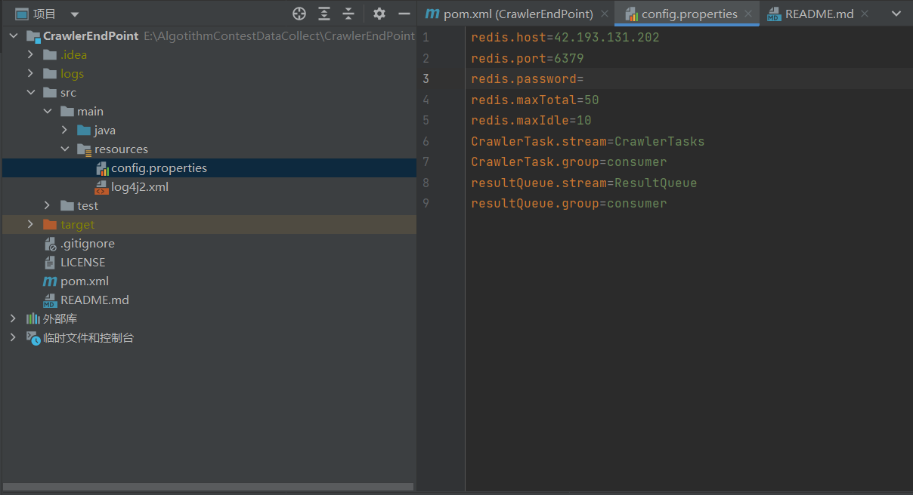

```properties
#redis服务器地址
redis.host=42.193.131.202 #redis服务器地址
#redis服务器端口
redis.port=6379 
#redis服务器密码
redis.password=
#爬虫任务消息队列名称,注意与控制端(Dispatcher)相同
CrawlerTask.stream=CrawlerTasks
#爬虫任务消费者组名称,注意与控制端(Dispatcher)相同
CrawlerTask.group=consumer
#爬虫结果消息队列名称,注意与控制端(Dispatcher)相同
resultQueue.stream=ResultQueue
#爬虫结果消费者组名称,注意与控制端(Dispatcher)相同
resultQueue.group=consumer
```


#### 第四步 启动


点击运行即可启动

启动完成状态

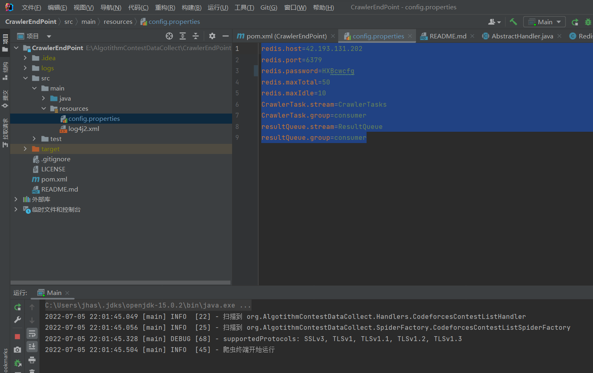


## 验证配置完成

访问springboot的 /codeforces/contestList

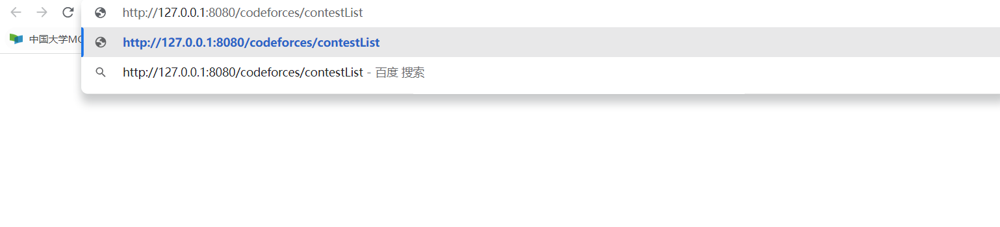

获得返回

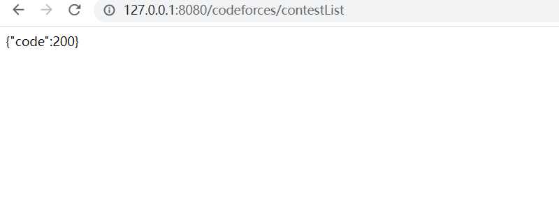

控制端推送并向数据库中写入

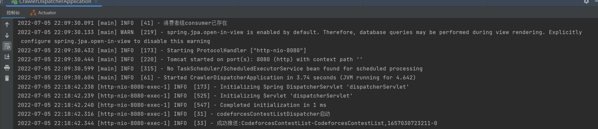

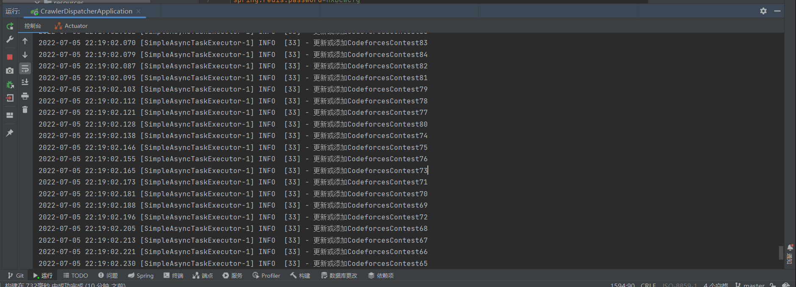


爬虫端获取到任务并下载页面

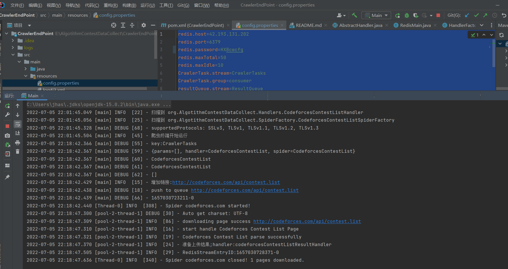


cf_contest表中有数据

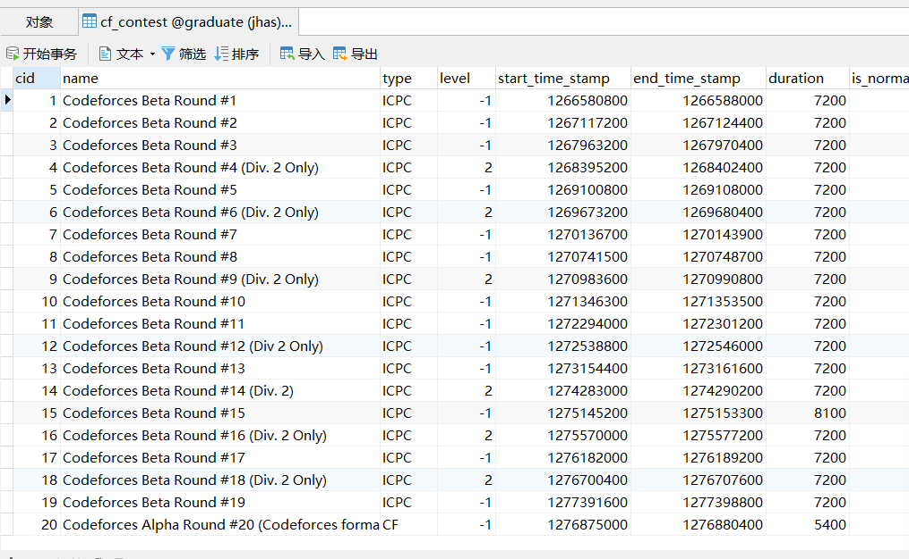