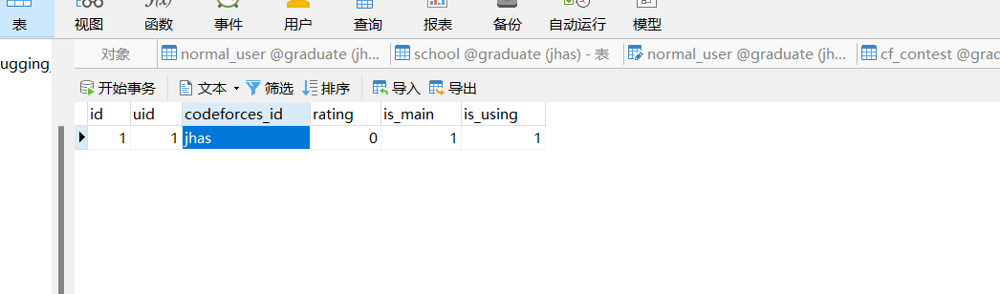
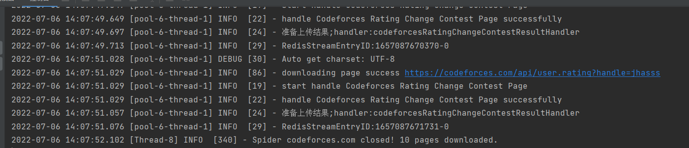

# 爬虫编写示例

本文以一个实际的需求来展示一个爬虫从设计到开发的全过程，阅读本文有助于使用者更好地理解与开发这个爬虫系统。

## 目录

[需求分析](#requirementAnalyse)

[爬虫设计](#spiderDesign)

[Step.0 预备工作](#step0)

[Step.1 编写Interface](#step1)

[Step2. 编写Dispatcher](#step2)

[Step3. 编写Endpoint Handler](#step3)

[Step4. 编写Processor 和 SpiderFactory](#step4)

[Step5. 编写resultHandler](#step5)

[结果验证](#result)

## <span id="requirementAnalyse">需求分析</span>

目前需求: 获取数据库中某个用户的所有有积分变化的Codeforces比赛信息，并将其放入数据库中

分析: 首先拿到的是一个比较抽象的需求，先把输入和输出定义完整，首先是输入 ：某个用户，我们可以定义为这个用户的ID，然后是输出是将数据存放到数据库中

上述分析还是比较粗犷的分析，接下来在爬虫设计中我们将需求一步一步地分解到各个模块中

## <span id="spiderDesign">爬虫设计</span>

根据爬虫的模块设计我们需要定义的是分布在两端的五种类,我们在这五种类实现我们地需求，同时达到可复用的效果

以下说明按照 输入 -> 输出 的顺序来设计

### Dispatcher端

#### HTTPInterface

我们会在HTTPInterface中获取用户ID，然后从数据库中获取到具体的用户信息，并形成参数进行包装

#### Dispatcher

我们会在Dispatcher中指定爬虫端的接收器，爬虫等信息。在这个类中将参数送入Redis中


### Crawler端

#### Handler

我们会在Handler中获取参数，并将其组装成相应URL或Request进行交给爬虫进行爬取。


#### SpiderFactory

我们会在SpiderFactory 对爬虫进行组装，将各个爬虫部件组装成一个完整的爬虫


#### Processor

我们会在Processor定义爬虫的爬取逻辑，获取具体的数据并指定对应的ResultHandler处理


### Dispatcher端

#### ResultHandler

我们会在ResultHandler处理爬虫经过Redis返回的数据，将数据整理并放入数据库中


## <span id="step0">Step.0 预备工作</span>

首先准备好数据库的数据，如果数据库已经有数据可以跳过该步骤

School表中准备一个BUCT


normal_user准备一个用户


cf_account 中准备一个账户



好了，我们可以开始编写爬虫了


## <span id="step1">Step1. 编写Interface</span>

我们爬取的是Codeforces的数据，所以我们应该把接口写在CodeforcesInterface这个类下，我们在CodeforcesInterface这个类下定义一个方法getStuContest，代码如下

```java
    @GetMapping("/GetStuContest/{uid}") //访问/GetStuContest/{uid}启动该方法,注意@PathVariable注解，这个注解用于获取路径参数
    public String getStuContest(@PathVariable Long uid, HttpServletRequest request, HttpServletResponse response){
        var ret = new JSONObject();
        try{
            LOGGER.info("getStuContest启动");
            LOGGER.info("获得参数"+uid);
            List<String> cfids = new ArrayList<>();
            try{
                List<CfAccountEntity> entities = cfAccountRepository.getCfAccountEntitiesByUid(uid); // 根据Uid获取对应Cf账户实体,这里使用了JPA与数据库连接，如果不会JPA请参考https://www.bilibili.com/video/BV1F54y1B7Gy
                for(var entity:entities){
                    cfids.add(entity.getCodeforcesId());
                }
            }catch (Exception e){
                ret.put("code",404);
                ret.put("msg","数据库异常或无此用户");
                return ret.toJSONString();
            }
            LOGGER.info("预备爬取{}的所有比赛记录",cfids);
            
            ret.put("code",200);
        }catch (Exception e){
//            LOGGER.info("codeforcesContestListDispatcher推送失败");
            LOGGER.error(e.toString());
            ret.put("code",404);
        }
        return ret.toJSONString();
    }
}
```

具体请看注释

写到这里我们来测试一下，在浏览器中输入http://127.0.0.1:8080/codeforces/GetStuContest/1 ,返回


然后看命令行


成功获取到了对应的codeforces账户名

当然到这一步Interface还没有全部完成，但是等我们之后再回来继续我们的编写


## <span id="step2">Step2. 编写Dispatcher</span>

编写Dispatcher的时候我们要注意一下命名规范(其实所有的类和字段都应该注意命名规范) : 类的首字母大写，字段首字母小写，其它后序单词首字母大写.

在这一步我们可以根据不同需要设计不同粒度的dispatcher和handler，在当前这个需求中我倾向设计一个爬取单个cf账户的调度器

我们要把我们编写的Dispatcher放到Dispatcher包中方便管理

CodeforcesStuContestDispatcher

```java
@Service // 为该类创建一个Bean实例，一定要加
public class CodeforcesStuContestDispatcher extends AbstractDispatcher {
    @Autowired
    private Environment environment;
    @Override
    protected String getSpider() {
        return "CodeforcesRatingChangeContestSpider";// Endpoint的Spider名称,会根据该名称调用Spider
    }

    @Override
    protected String getHandler() {
        return "SingleCodeforcesStuContestHandler"; // Endpoint的Handler名称,会根据该名称调用Handler
    }

    @Override
    protected String getStream() {
        return environment.getProperty("CrawlerTask.stream"); // 自定义接收器，可以自行设置上传的redis Stream，为以后分布式爬虫留作接口
    }
}
```

再回到Interface，这时候我们就可以调用我们刚写好的Dispatcher了

```java
   @GetMapping("/GetStuContest/{uid}") //访问/GetStuContest/{uid}启动该方法,注意@PathVariable注解，这个注解用于获取路径参数
    public String getStuContest(@PathVariable Long uid, HttpServletRequest request, HttpServletResponse response){
        var ret = new JSONObject();
        try{
            LOGGER.info("getStuContest启动");
            LOGGER.info("获得参数"+uid);
            List<String> cfids = new ArrayList<>();
            try{
                List<CfAccountEntity> entities = cfAccountRepository.getCfAccountEntitiesByUid(uid); // 根据Uid获取整个Cf实体,这里使用了JPA与数据库连接，如果不会JPA请参考https://www.bilibili.com/video/BV1F54y1B7Gy
                for(var entity:entities){
                    cfids.add(entity.getCodeforcesId());
                }
            }catch (Exception e){
                ret.put("code",404);
                ret.put("msg","数据库异常或无此用户");
                return ret.toJSONString();
            }
            LOGGER.info("预备爬取{}的所有比赛记录",cfids);
            for(var cfid: cfids){
                JSONArray param = new JSONArray(); // 参数一定是要JSONArrau传递，且一定要基础类型，不能是对象，如果是对象需要先序列化
                param.add(cfid);//add方法添加参数
                dispatcherFactory.dispatch("codeforcesStuContestDispatcher",param);//调用Dispatcher，第一个参数是dispatcher的首字母小写，如CodeforcesStuContestDispatcher 变成codeforcesStuContestDispatcher,第二个为刚刚的参数,(可能你会好奇为什么调用的是dispatcherFactory而不是CodeforcesStuContestDispatcher,因为会通过dispatcherFactory来统一调用其它的具体的类)
            }
            ret.put("code",200);
        }catch (Exception e){
            LOGGER.info("codeforcesStuContestDispatcher推送失败");
            LOGGER.error(e.toString());
            ret.put("code",404);
        }
        return ret.toJSONString();
    }
}
```

至此，如果再触发getStuContest ，我们会将一个爬取请求放到redis中，接下来让我们从redis中取出请求


## <span id="step3">Step3. 编写Endpoint Handler</span>

让我们来到Endpoint

首先编写一个用于处理参数的Handler

我们要把我们编写的Handler放到Handlers包中方便管理

我们先看看我们需要用到的URL，根据Codeforces官方给的API(https://codeforces.com/apiHelp)，我们可以知道https://codeforces.com/api/user.rating是符合我们的要求的

然后我们来编写Handler

```java
public class SingleCodeforcesStuContestHandler extends URLAbstractHandler{
    @Override
    public String getName() {
        return "SingleCodeforcesStuContestHandler"; // 这里是触发该Handler的名字，与dispatcher中相对应
    }

    @Override
    protected List<String> getUrls(JSONArray params) {
        String cfid = params.getString(0); // 使用JSONArray获取参数
        List<String> urls = new ArrayList<>();
        urls.add("https://codeforces.com/api/user.rating?handle="+cfid); // 组成url放到urls中
        return urls;
    }
}
```

编写完成后即完成，我们不需要显式调用这个Handler，框架会自动帮我们调用它


## <span id="step4">Step4. 编写Processor 和 SpiderFactory</span>

在编写之前先解释一下这两个类

Processor ： 爬虫的核心处理逻辑，获取到页面之后会交给Processor处理

SpiderFactory：爬虫的工厂类，用于组装一个爬虫，一个爬虫由一个PageProcessor、一个Downloader、一个Scheduler和若干个Pipeline组成

以上涉及到的类都是[WebMagic](http://webmagic.io/docs/zh/)的类，EndPoint是基于WebMagic的再包装。

我们先来编写Processor

```java
public class CodeforcesRatingChangeContestProcessor implements PageProcessor {
    private static final Logger LOGGER = LoggerFactory.getLogger(CodeforcesRatingChangeContestProcessor.class);
    private Site site = Site.me().setRetryTimes(3).setSleepTime(1000); // 设置页面会重试三次，每次重试间隔1秒
    //数据提前逻辑在process中编写
    @Override
    public void process(Page page) {
        LOGGER.info("start handle Codeforces Rating Change Contest Page");
        JSONObject main = JSON.parseObject(page.getRawText());// 根据返回的页面使用JSON来处理
        if (main.getString("status").equals("OK")){
            LOGGER.info("handle Codeforces Rating Change Contest Page successfully");
            JSONArray contestList = main.getJSONArray("result"); // 提取result字段
            page.putField("handler","codeforcesRatingChangeContestResultHandler");//指定Dispatcher的handler，与指定Dispatcher相似,首字母小写CodeforcesRatingChangeContestResultHandler变成codeforcesRatingChangeContestResultHandler
            page.putField("result",contestList);//爬取的结果放到result中
        }else{
            LOGGER.error("handle Codeforces Rating Change Contest Page fail");
        }
    }

    // 获取当前的site
    @Override
    public Site getSite() {
        return site;
    }
}

```

然后再来编写SpiderFactory

```java
public class CodeforcesRatingChangeContestSpiderFactory extends SpiderFactory{
    @Override
    protected PageProcessor getPageProcessor() {
        return new CodeforcesRatingChangeContestProcessor(); //我们刚刚编写好的PageProcessor
    }

    @Override
    protected List<Pipeline> getPipelines() {
        List<Pipeline> Pipelines = new ArrayList<Pipeline>();
        Pipelines.add(new RedisPipeline());
        return Pipelines; //使用RedisPipeline代表我们把结果上传到redis中
    }

    @Override
    protected Scheduler getScheduler() {
        return new NoDuplicateRemoveScheduler(); //使用不去重的队列
    }

    @Override
    protected Downloader getDownloader() {
        return new HttpClientDownloader(); //使用普通的HTTP请求器
    }

    @Override
    public String getSpiderName() {
        return "CodeforcesRatingChangeContestSpider"; // 爬虫名称，注意与Dispatcher对应
    }
}
```

编写完成后即完成，同样地我们不需要显式地调用SpiderFactory，框架替我们完成了调用操作


## <span id="step5">Step5. 编写resultHandler</span>

resultHandler主要任务是把我们爬取的结果添加到数据库中保存下来

```java
package org.algotithmcontestdatacollect.crawlerdispatcher.ResultHandlers;

import com.alibaba.fastjson.JSON;
import com.alibaba.fastjson.JSONArray;
import com.alibaba.fastjson.JSONObject;
import org.algotithmcontestdatacollect.crawlerdispatcher.Repositories.CfAccountRepository;
import org.algotithmcontestdatacollect.crawlerdispatcher.Repositories.CfStucontestRepository;
import org.algotithmcontestdatacollect.crawlerdispatcher.TableEntity.CfStucontestEntity;
import org.slf4j.Logger;
import org.slf4j.LoggerFactory;
import org.springframework.beans.factory.annotation.Autowired;
import org.springframework.stereotype.Service;

@Service // 为该类创建一个Bean实例，一定要加
public class CodeforcesRatingChangeContestResultHandler extends AbstractHandler {
    private static final Logger LOGGER = LoggerFactory.getLogger(CodeforcesRatingChangeContestResultHandler.class);
    @Autowired
    private CfStucontestRepository cfStucontestRepository;
    @Autowired
    private CfAccountRepository cfAccountRepository;
    @Override
    public void handle(String result) {
        JSONObject res = JSONObject.parseObject(result);//将数据序列化
        String codeforcesID = res.getString("handler"); // 获取cf账户
        JSONArray ratingChangeList = res.getJSONArray("ratingChangeList");// 结果列表
        var cfAccountEntity = cfAccountRepository.getCfAccountEntityByCodeforcesId(codeforcesID); // 因为不是直接用cf账户存放，需要获取对应cf账户的ID
        if (cfAccountEntity == null){
            LOGGER.error("账户{}:不在数据库中",codeforcesID);
            return;
        }
        int NowRating = 0;
        for (int i = 0;i<ratingChangeList.size();i++){ // 一个一个查
            JSONObject ratingChange = ratingChangeList.getJSONObject(i);
            int newRating = ratingChange.getInteger("newRating");
            int oldRating = ratingChange.getInteger("oldRating");
            int rank = ratingChange.getInteger("rank");
            Long cid = ratingChange.getLong("contestId");
            NowRating = newRating;
            if(!cfStucontestRepository.existsCfStucontestEntityByCfidAndCid(cfAccountEntity.getId(),cid)){ // 没有才放进数据库
                CfStucontestEntity cfStucontestEntity = new CfStucontestEntity();
                cfStucontestEntity.setDiff(newRating - oldRating);
                cfStucontestEntity.setCid(cid);
                cfStucontestEntity.setCfid(cfAccountEntity.getId());
                cfStucontestEntity.setRank(rank);
                cfStucontestEntity.setRating(newRating);
                cfStucontestRepository.save(cfStucontestEntity);
             }
        }
        cfAccountEntity.setRating(NowRating);
        cfAccountRepository.save(cfAccountEntity); // 更新当前cf账户
    }
}

```


编写完成后一个爬虫就做完了


## <span id="result">结果验证</span>

浏览器访问url


springboot没有报错


Endpoint运行正常




数据库中有数据


至此爬虫完成
